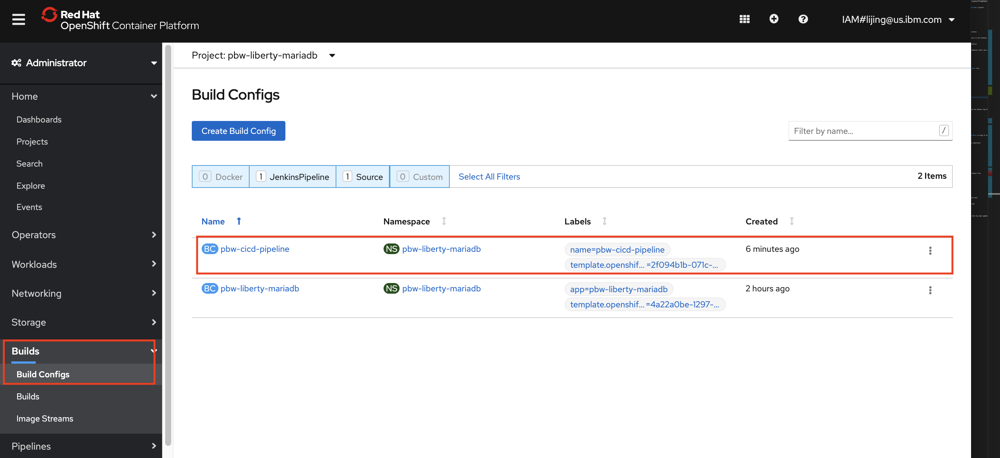
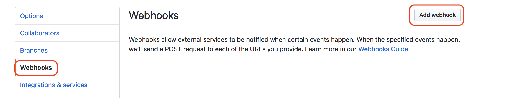

# IBM Client Developer Advocacy App Modernization Series

## Lab - Automated updates of containerized applications from SCM commits

### Creating a CI/CD Pipeline for deployment to OpenShift  using Jenkins

## Overview

In this lab you will  be connecting your Git repository with the Plants by WebSphere app to a Continuous Integration/Continuous Deployment pipeline built with Jenkins that will deploy to an OpenShift cluster.

## Setup

If you haven't already:

Complete the lab exercise *S2I and Template  Lab for the App Modernization Dojo on OpenShift on IBM Cloud Kubernetes Service* by following the instructions [here](https://github.com/IBMAppModernization/app-modernization-openshift-templates-lab-iks)

### Step 1: Install Jenkins in your OpenShift cluster

1.1 Open the OpenShift web console in your browser and mke sure you're in the **pbw-liberty-mariadb** project.

   

1.2 Select `+Add` in the left pane.

1.3 Select **From Catalog** tile in the window on the right.

1.4 Select the **CI/CD** category and then select on **Jenkins (Ephemeral)**

   

1.5 Select `Instantiate Template`.

1.6 Accept all default click **Create**.

1.7 Wait until the status of the Jenkins instance becomes `Ready` (note this may take a few minutes).

   

1.8 In the terminal window, run the following command to give Jenkins Service Account push access to the internal container registry

   ```bash
   oc policy add-role-to-user system:image-builder system:serviceaccount:pbw-liberty-mariadb:jenkins
   ```
### Step 2: Create Pipeline from a template

2.1  From the terminal run the following command to install the Plants by WebSphere pipeline template (note: you need to be in the top level folder of the cloned  Plants by WebSphereGitHub repo)

   ```bash
   oc create -f openshift/templates/cicd/pbw-liberty-cicd-pipeline.yaml
   ```
2.2 In your Web console browser tab make sure you're in the **pbw-liberty-mariadb** project.

2.3 Select `+Add` in the left pane.

2.4 Select **From Catalog** tile in the window on the right.

2.5 Select the **Other** category and then click **Plants by WebSphere on Liberty CI/CD Pipeline** tile.

   

2.6 Select `Instantiate Template`.

2.7 Change the **Source URL** to the url of your clone of the Plants by WebSphere repo

   

2.8 Scroll down and select **Create**.


### Step 3: Manually trigger a build to test pipeline

3.1 In your OpenShift Web console, switch to `Administrator` view.

   

3.2 Select **Builds -> Build Configs** in the left pane.

  

3.3 Select `pbw-cicd-pipeline` to open the pipeline.

3.4 Select `Start Build` from the `Actions` menu.

3.5 Once the Pipeline starts, navigate to `Logs` tab and click on **View Log**. This will take you into Jenkins console and display the Jenkins log for the pipeline. (Note: you may be prompted to use your OpenShift credentials for Jenkins)

3.6 Verify that the pipeline runs without errors. In Jenkins console, you should see the following log entries when the pipeline execution completes:

   

3.7 In the OpenShift console, you should see `Complete` status on the `Overview` tab of `Build Detail`.

   

### Step 4: Trigger a build via a commit to Github

The BuildConfig for your pipeline is  already configured to be triggered by a Github webhook

4.1 In your Web console, select **Builds -> Build Configs** in the left pane.

  

4.2 Select `pbw-cicd-pipeline` to open the pipeline.

4.3 Scroll down to the **Webhooks** section.

4.4 Copy the `Github Webhook URL` to the clipboard

  

4.5 In another browser tab go to https://github.com and open your cloned `Plants by WebSphere` repository

4.6  Navgate to the repository `Settings` tab

   

4.7 Navigate to the **Webhooks** subtab.

4.8 Click **Add webhook**

   

4.9  For the Payload URL, paste in the URL you copied to your clipboard in the previous step.

4.10 Change content type to **application/json**.

4.11 Accept the other defaults and click **Add webhook**

   

4.12 In the Github repo, drill down to *pbw-web/src/main/webapp/promo.xhtml*.

4.13 Click on the `pencil` icon to edit the file **promo.xhtml**.

4.14 At line 95, locate the price of the Bonsai Tree.

4.15 Change `$30.00 each` to `<strike>$30.00</strike> $25.00 each`

   This will show the price of the Bonsai Tree as being reduced even more

   

4.16 At the bottom of the UI window add a commit message and click on **Commit changes**

4.17 Switch back to your OpenShift console and select **Builds -> Builds** in the left pane.

4.18 Verify that your pipeline is running.

   

4.19 Once the pipeline has completed, select **Networking -> Routes** in the left navigation pane.

4.20 Select `pbw-liberty-mariadb`.

4.21 The application route is available on this window.

   

4.22 Click on the `Location` link of **pbw-liberty-mariadb** to launch the Plants by WebSphere app.

4.23 Verify that the price of the bonzai tree has changed.

  

## Summary

You created a Jenkins pipeline from within OpenShift to automatically build and deploy an app that has been updated in Github .
