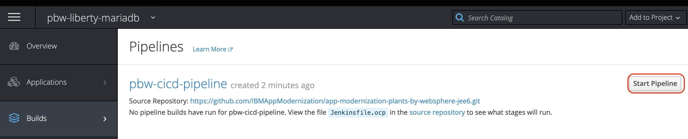

# IBM Client Developer Advocacy App Modernization Series

## Lab - Automated updates of containerized applications from SCM commits

### Creating a CI/CD Pipeline for deployment to OpenShift  using Jenkins

## Overview

In this lab you will  be connecting your Git repository with the Plants by WebSphere app to a Continuous Integration/Continuous Deployment pipeline built with Jenkins that will deploy to an OpenShift cluster.

## Setup

If you haven't already:

Complete the lab exercise *S2I and Template  Lab for the App Modernization Dojo on OpenShift on IBM Cloud Kubernetes Service* by following the instructions [here](https://github.com/IBMAppModernization/app-modernization-openshift-templates-lab-iks)

### Step 1: Install Jenkins in your OpenShift cluster

1.1 Open the OpenShift web console in your browser and mke sure you're in the **pbw-liberty-mariadb** project.

   

1.2 Select `+Add` in the left pane.

1.3 Select **From Catalog** tile in the window on the right.

1.4 Select the **CI/CD** category and then select on **Jenkins (Ephemeral)**

   

1.5 Select `Instantiate Template`.

1.6 Accept all default click **Create**.

1.7 Wait until the status of the Jenkins instance becomes `Ready` (note this may take a few minutes).

   

1.8 In the terminal window, run the following command to give Jenkins Service Account push access to the internal container registry

   ```bash
   oc policy add-role-to-user system:image-builder system:serviceaccount:pbw-liberty-mariadb:jenkins
   ```
### Step 2: Create Pipeline from a template

2.1  From the terminal run the following command to install the Plants by WebSphere pipeline template (note: you need to be in the top level folder of the cloned  Plants by WebSphereGitHub repo)

   ```bash
   oc create -f openshift/templates/cicd/pbw-liberty-cicd-pipeline.yaml
   ```
2.2 In your Web console browser tab make sure you're in the **pbw-liberty-mariadb** project.

2.3 Select `+Add` in the left pane.

2.4 Select **From Catalog** tile in the window on the right.

2.5 Select the **Other** category and then click **Plants by WebSphere on Liberty CI/CD Pipeline** tile.

   

2.6 Select `Instantiate Template`.

2.7 Change the **Source URL** to the url of your clone of the Plants by WebSphere repo

   

2.8 Scroll down and select **Create**.


### Step 5: Manually trigger a build to test pipeline

5.1 In your Web console browser tab select **Build -> Pipelines**

  

5.2 Click on **Start Pipeline**

  

5.3 Once the Pipeline starts click on **View Log**. This will take you into Jenkins and display the Jenkins log for the pipeline. (Note: you may be prompted to use your OpenShift credentials for Jenkins)

   

5.4 Verify that the pipeline runs without errors. You should see output like the following:

   

### Step 6: Trigger a build via a commit to Github

The BuildConfig for your pipeline is  already configured to be triggered by a Github webhook

6.1 In your Web console browser tab select the **pbw-cicd-pipeline**

  

6.2 Click on the **Configuration** tab and then click on the icon next to the **GitHub Webhook URL** to copy it to the clipboard

  

6.3 In another browser tab go to https://github.com and select your cloned Plants by WebSphere repository

6.4  Click on the repository settings

   

6.5 Under **Options** select **Webhooks** and click **Add webhook**

   

6.6  For the Payload URL paste in the URL you copied to your clipboard in step 5.2

Change content type to **application/json**

6.7  Accept the other defaults and click **Add webhook**

   

6.8  In the Github file browser drill down to *pbw-web/src/main/webapp/promo.xhtml*

6.9  Click on the pencil icon to edit **promo.xhtml**  and on line 95 locate the price of the Bonsai Tree

6.10  Change  `$30.00 each` to `<strike>$30.00</strike> $25.00 each`

   This will show the price of the Bonsai Tree as being reduced even more

   

6.11 At the bottom of the UI window add a commit message and click on **Commit changes**

6.12 Switch back to your OpenShift console and open the **pbw-cicd-pipeline**

6.13 Verify that your pipeline  starts building.

   

6.14 Once the pipeline has completed select **Applications -> Routes** from  the left navigation menu

   

6.15 Click on the hostname link for **pbw-liberty-mariadb** to launch the Plants by WebSphere app

6.16 Verify that the price of the bonzai tree has changed.

  

## Summary

You created a Jenkins pipeline from within OpenShift to automatically build and deploy an app that has been updated in Github .
